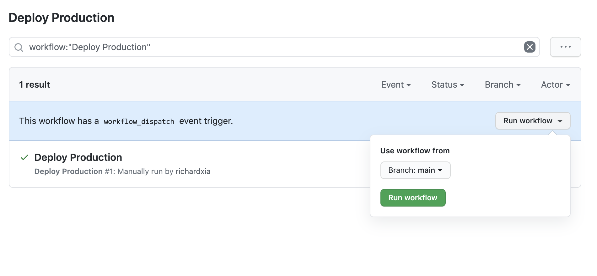

# How To Deploy

sheltertech.org has two deployment environments: staging.sheltertech.org and
www.sheltertech.org. Both are hosted on [AWS S3](https://aws.amazon.com/s3/)
buckets, and the deployments are both done via
[GitHub Actions](https://docs.github.com/en/actions).

Staging deployments are automatically triggered when a pull request is merged
into the `main` branch.

Production deployments must be manually triggered from the GitHub web interface.
To deploy, click on the
[Actions](https://github.com/ShelterTechSF/sheltertech.org/actions) tab from any
GitHub page within the sheltertech.org repository, and then click on the
[Deploy Production](https://github.com/ShelterTechSF/sheltertech.org/actions?query=workflow%3A%22Deploy+Production%22)
workflow on the left side bar. Then click the **Run workflow** button on the
right side, select the `main` branch, and then click the green **Run workflow**
button. After the workflow finishes running, you should see the updated site at
www.sheltertech.org.

